

  

<h1 align="center">Duel Lens</h1>

  <b>Read any Yu-Gi-Oh! card in a duel video, without leaving the stream.</b> 
  Press a shortcut and point at a card for a quick look. Click it, and its full text appears right beside it.

  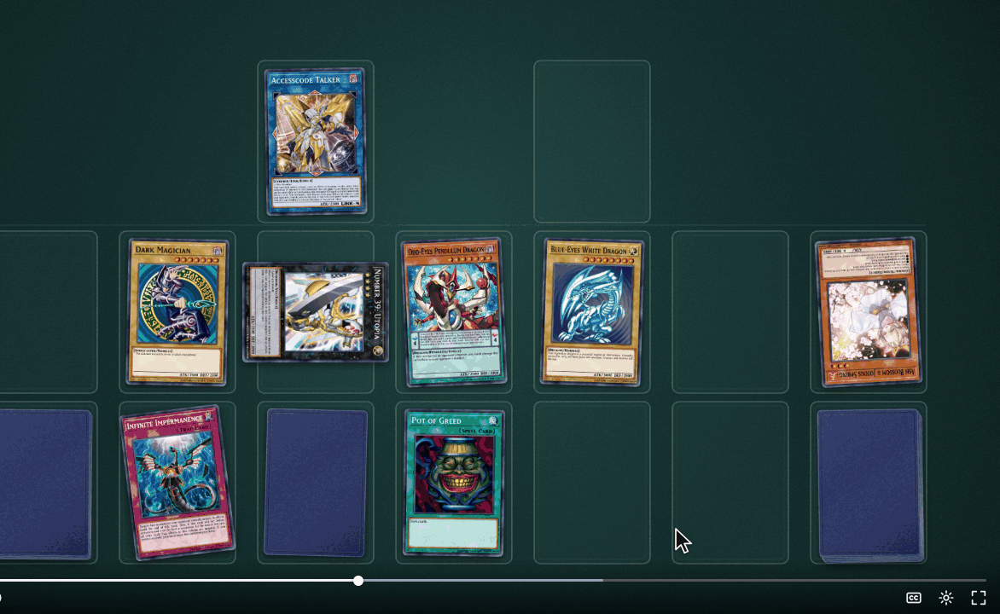

Duel Lens is an unofficial fan tool, not affiliated with or endorsed by Konami.

The clips in this README are recorded from the real extension, on a made-up duel (no broadcast footage).

## What it does

- **Reads the cards on your screen:** YouTube duels, tournament streams, VODs, deck lists, screenshots.
- **Point, then click:** the frame freezes and every card on it gets a gold outline. Point at a card for a
  quick preview, click it for the full card, then click the next one: Duel Lens stays open until you're
  done. Or draw a box around any card.
- **Shows the card right there:** its official picture, type, Attribute, Level, ATK/DEF, TCG banlist
  status, Genesys points and the full card text. No new tab, no search.
- **Tells you when it isn't sure,** and lets you flip through the closest matches.
- **Remembers what you looked up** in Chrome's side panel, with the moment in the video.
- **Recognition runs on your computer.** No account, no analytics, free. An optional AI check uses your
  own Anthropic key.

## Install

**Chrome Web Store:** coming soon.

**Manual install,** from a release zip:

1. Download `duel-lens-<version>.zip` from the [latest release](https://github.com/mathulbrich/duel-lens/releases/latest) and unzip it into a folder
   you'll keep (Chrome loads the extension from there).
2. Open `chrome://extensions` and turn on **Developer mode** (top right).
3. Click **Load unpacked** and pick the unzipped folder.
4. Optional: pin Duel Lens to the toolbar (the puzzle-piece icon, then the pin).

It needs Chrome 124 or newer. A manual install doesn't update itself: to update, replace the folder's
contents with the new release and click the reload icon on Duel Lens's card in `chrome://extensions`.

**First run: Duel Lens asks for your OK.** Its welcome page opens when you install it. Read what it
handles and press **Agree and start**. Until you do, the shortcut opens this step instead of scanning,
and **Not now** keeps scans off.

  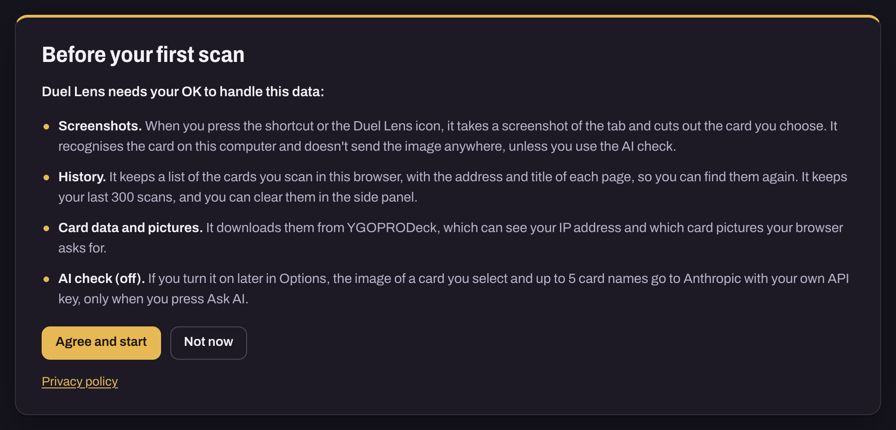

## How to use it

1. **Press Alt+Shift+Y** (on a Mac, Option+Shift+Y, shown as ⌥⇧Y), or click the Duel Lens icon in the
   toolbar. The picture freezes, the video pauses, and every face-up card on it gets a gold outline.
2. **Point at a card** for a quick preview: its name, type and ATK/DEF.
3. **Click it** (or drag a box around it) to read it in full, in the popover beside the card. **Click
   another card** to read that one: Duel Lens stays open.
4. **Esc** closes the card. Press **Esc** again, or the **✕** on the bar at the top, to leave; **Space**
   or **K** resumes the video.

Another extension may already use Alt+Shift+Y; then Duel Lens's shortcut shows as "Not set". Pick any
keys you like at `chrome://extensions/shortcuts` (the toolbar icon always works too).

## Features

### Click to scan

After the shortcut, Duel Lens finds every face-up card on the frozen frame and outlines it in gold;
the rest of the picture dims. Click a card to read it, then click the next one: its details replace the
first card's (the clip at the top of this page). Duel Lens stays open until you leave, so one press of the
shortcut is enough for the whole board. Cards lying sideways, upside down or tilted are outlined as they
lie. Face-down cards, sleeves and deck piles get no outline: there's nothing on them to read.

A small bar at the top of the page says how many cards are outlined, with a **✕** to leave. A click on
an empty part of the picture closes the card you're reading and keeps the outlines.

Prefer the keyboard? **Tab** / **Shift+Tab** or the arrow keys step through the outlined cards, and
**Enter** reads the one in focus.

### A quick look on hover

Rest the pointer on an outlined card for a moment, and a small preview shows its name, its type and
ATK/DEF, with its banlist status and Genesys points. Move to the next card and the preview follows; click
when you want the full card. With the keyboard, the card in focus shows its preview too.

  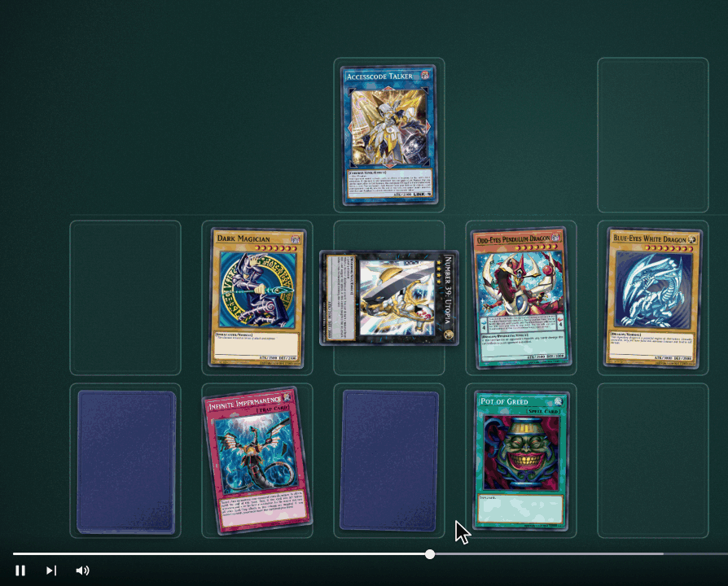

- **When Duel Lens isn't sure,** the preview says so: **Not sure:** and its best guess, **Low match:
  click for options**, or **No match: click to try**. A click shows what it found.
- **A preview is only a look.** It isn't saved to your history and never uses the AI check: only the cards
  you click (or box) are.
- **Esc** hides a preview. You can move the pointer onto it to read it, and a click on it opens the card.
- **Rather click only?** In Duel Lens's Options, **Show card details** has two choices: **Hover or click**
  (the default) and **Click**, where nothing shows until you click.

### Drag a box, or click two corners

Drag a box around any card: the whole card, or just its artwork. It works on a card without an outline
too, and before the outlines appear.

  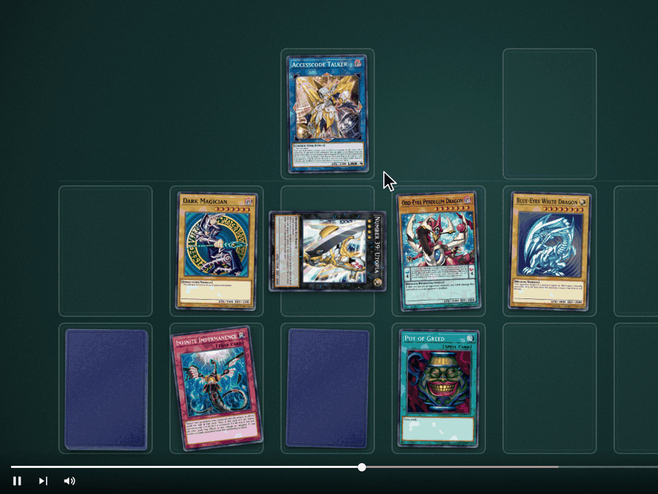

Rather not drag? Click beside the card, where nothing is outlined, to set one corner; a box follows the
pointer; click the opposite corner to read it. **Esc**, or a click back on the first corner, drops the
corner. While a card's details are open, that first click only closes them: click again to set the
corner.

  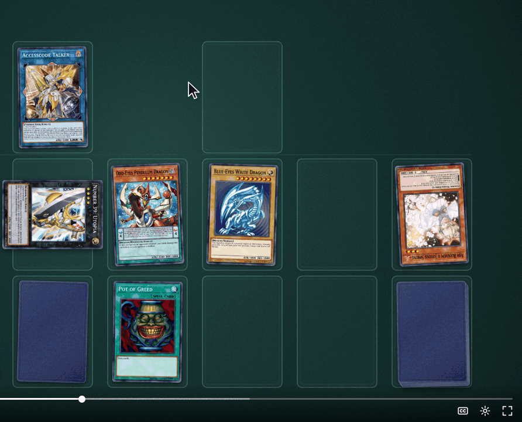

### What the popover shows

  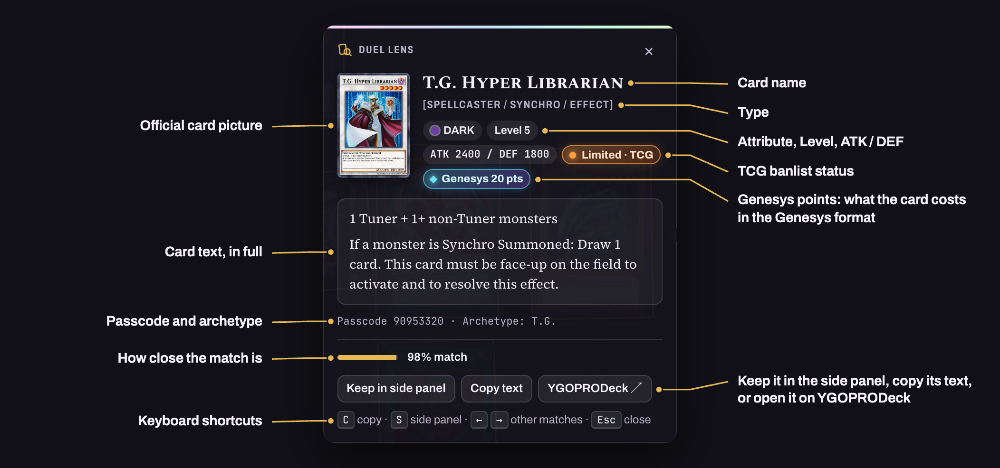

- **The card:** its official picture, name and type.
- **Its facts:** Attribute, Level, Rank or Link rating (with the Link arrows), Pendulum Scale, ATK and
  DEF.
- **TCG banlist status:** Forbidden, Limited or Semi-Limited, in red, orange or yellow. Nothing shows
  for an unlimited card.
- **Genesys points:** what the card costs in the Genesys format. Only cards that cost points show them.
- **The full text,** with a Pendulum card's two effects apart, then the passcode and archetype.
- **How close the match is:** how similar the artwork looks, as a percentage. It isn't a probability.
- **Keep in side panel, Copy text, YGOPRODeck:** keep it (below), copy its text, or open its page on
  [YGOPRODeck](https://ygoprodeck.com/), where Duel Lens's card data and pictures come from.

The picture is the card's official image from YGOPRODeck, downloaded the first time Duel Lens shows that
card and then cached on your computer.

### "Not sure" and other matches

When the match isn't clear enough to call (motion blur, glare, a small or low-quality card), the popover
says **Not sure** and shows its best guess, with up to three other close matches under "Could also be".
Press **→** / **←** to step through them, or click one. Picking one also fixes that scan in your history.
A confident answer lists any close look-alikes too, under "Not it?".

When the match is weaker still but Duel Lens can see there's a card there (you clicked its outline, or
your box holds one), it doesn't give up: it shows its closest guesses under **Low match: this could be
it** (or "could be one of these"). Treat those as hints, not answers. Online duel simulators that print a
pile count over the top card, such as DuelingBook's "1", get a second try with the number painted out.

  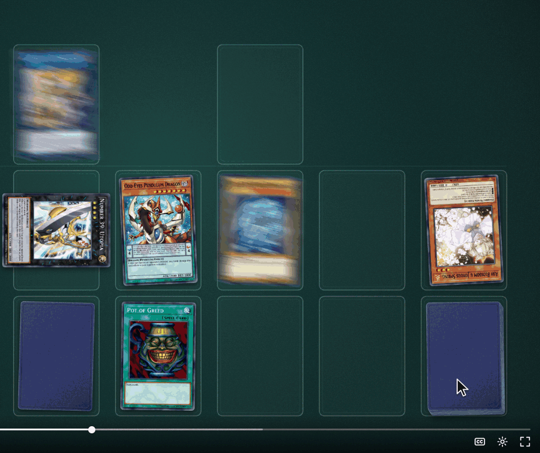

### Keep it in the side panel

Press **S** (or **Keep in side panel**) to open Chrome's side panel on the card: its picture in full,
all its details and text, and below, **This session**: the cards you scanned, each with its time (for a
video, the moment in the video). On YouTube, that time is a link back to the moment. Click an entry to
see its card again; **Clear history** empties the list. **Alt+Shift+U** opens the panel at any time.
While it's open, each card you click shows there in full too.

  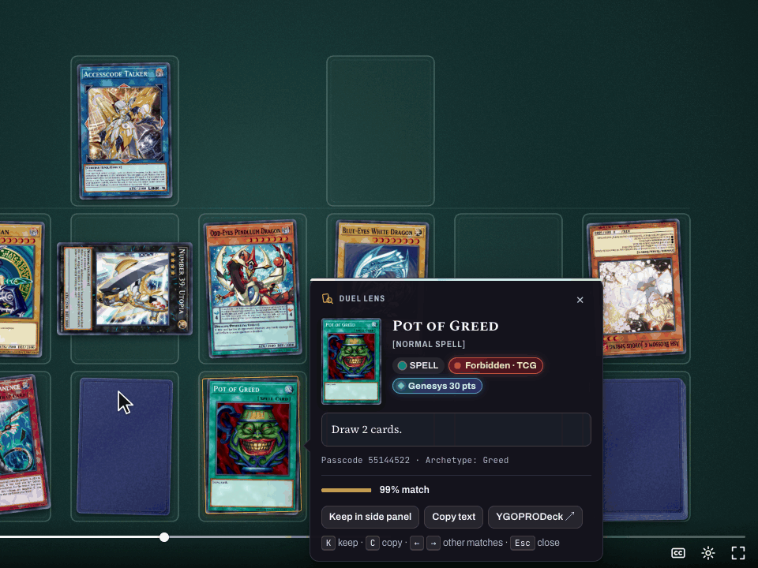

The history keeps your last 300 scans, in this browser only. A preview isn't a scan: only the cards you
click or box are kept.

### Keyboard shortcuts

| Key | What it does |
|---|---|
| **Alt+Shift+Y** (Mac: ⌥⇧Y) | Scan: freeze the picture and outline the cards. Pressed again, it leaves |
| **Tab** / **Shift+Tab**, arrow keys | Step through the outlined cards (with **Hover or click**, the one in focus shows its preview) |
| **Enter** | Read the outlined card in focus |
| **←** / **→** | Show the other matches |
| **C** | Copy the card's text |
| **S** | Keep in side panel: open the side panel on this card |
| **Esc** | Close the card's details, or its preview; with nothing open, leave Duel Lens (a right-click on the picture leaves too) |
| **Space** or **K** | Leave Duel Lens and resume the video |
| **Alt+Shift+U** (Mac: ⌥⇧U) | Open the side panel |

While Duel Lens is open, these keys go to Duel Lens, not to the page, so YouTube won't turn on captions
or skip under it; Space and K, YouTube's own play keys, leave Duel Lens and resume the video. Change the
two shortcuts at `chrome://extensions/shortcuts`.

### The video waits for you

While Duel Lens is open, the video on the page pauses: the frozen frame is a picture of the moment you
pressed the shortcut, so nothing runs on underneath. When you leave, it plays again, unless you had
paused it yourself. To leave, press **Esc** (twice if a card is open), click the **✕** on the bar at the
top, or press the shortcut again; **Space** or **K** resumes the video. Resizing the window or switching
fullscreen leaves too, since the frozen frame would no longer match the page.

  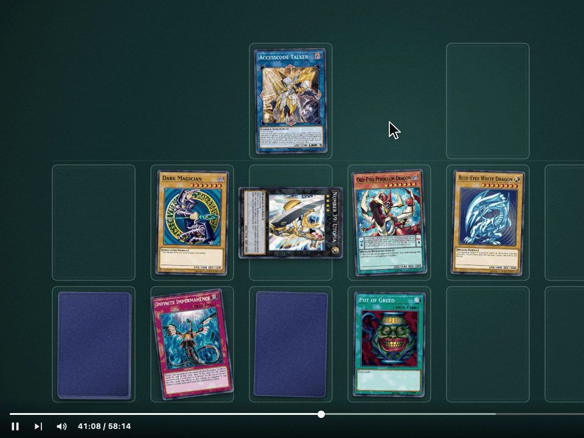

### Cards cut off at the edge

If a card runs off the edge of the picture and the normal match finds nothing, Duel Lens tries once more
and completes the missing part. At best that gives a **Not sure** with its best guess, never a confident
answer. If too much is missing, it says so: "Part of this card is outside the picture. Try when it's
fully in view, or box just its artwork."

  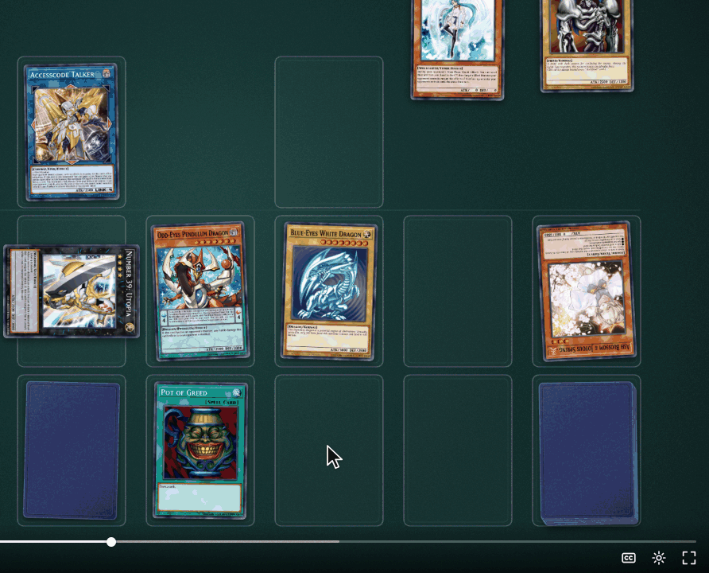

### Optional: ask Claude for a second opinion

Off by default. In Duel Lens's **Options → AI check**, turn on **Offer to ask Claude when a match is
unsure**, allow access to api.anthropic.com when Chrome asks, paste your own Anthropic API key and press
**Test**. An **Ask AI** button then appears on unsure matches, in the card's full details (a preview never
asks).

Only when you press **Ask AI** does Duel Lens send something: the cropped image of that card and up to
five candidate card names, with your key, to Anthropic (api.anthropic.com). Anthropic bills each check
to your key, usually about 1 to 2 US cents with Claude Opus 5 and less with Claude Sonnet 5. Your key
stays in this browser and is sent only to Anthropic. Turning the check off takes the permission back.

  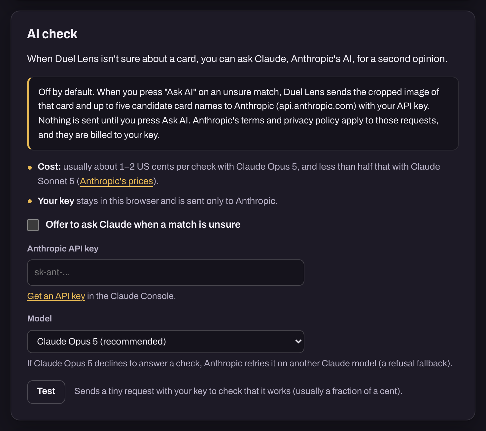

## Tips for good matches

- **Scan a clear moment.** Pause where the card is still and sharp, then press the shortcut: hands
  moving, the camera panning and motion blur all hurt.
- **Use 720p or higher** (on YouTube: the gear icon, then Quality). When a match is unsure on a video of
  480p or lower, Duel Lens says "Raise the video quality for a better match".
- **Wait for the glare to pass.** Foil and sleeve reflections can hide the artwork; a frame or two later
  often reads fine.
- **Box just the artwork** when the rest of the card is covered or hard to see.
- **On pictures and deck lists** (not videos), a bigger card helps: zoom in, or use theater mode or
  fullscreen.

## Privacy in brief

- **Recognition runs on your computer.** The screenshot and the cards you pick or point at are matched by
  Duel Lens's own models in your browser, and aren't uploaded anywhere.
- **No account, no ads, no analytics.** Duel Lens has no server of its own.
- **YGOPRODeck** ([ygoprodeck.com](https://ygoprodeck.com/)) supplies the card data (checked for new
  cards once a week), the card pictures (each downloaded the first time Duel Lens shows it, then cached)
  and new cards' artwork, so Duel Lens can recognise them too. These requests carry nothing from your
  screen, but like any website, YGOPRODeck sees your IP address and which card pictures your browser
  asks for.
- **Anthropic** receives a card image and up to five card names only if you turn on the AI check and
  press Ask AI.
- **Your history** (the card, the page's address and title, the time and the video time) stays in this
  browser. Only the cards you click or box are recorded, not the ones you preview. Clear it in the side
  panel; uninstalling Duel Lens removes everything it stored.

Read the full [privacy policy](docs/release/privacy-policy.md). Duel Lens carries a copy too: Options →
About → Privacy policy.

## Known limitations

- **Full-card foil and overframe prints** (Starlight Rare, Collector's Rare, overframe art): the foil or the
  art spread over the whole card looks unlike the standard card image, so some aren't recognised, or
  get a wrong "Low match" list.
- **Stacked and covered cards:** in a pile of overlapping cards, a click on the top card reads it, but the
  cards under it usually get no outline. A card partly covered by a hand or another card doesn't get the
  second try that cut-off cards do: expect "Not sure" or "Low match" at best, and under another card,
  that guess can be the card on top. Wait for a clearer frame, or box just the visible artwork.
- **Very small or very blurry cards:** expect "Not sure" or no match.
- **Cards outside YGOPRODeck's database** (anime-only cards, custom cards, proxies) and Speed Duel Skill
  cards can't be identified. A brand-new card is recognised once its artwork is on YGOPRODeck (Duel Lens
  downloads new artwork by itself), usually within about a day or a week of release. Alternate artworks
  that YGOPRODeck has no picture of are recognised too, for 267 official artworks printed in the TCG
  (such as Ash Blossom & Joyous Spring's third); the popover then shows the card's usual picture.
- **Some pages are off-limits:** DRM-protected players ("This video blocks screenshots"), Chrome's own
  pages and the Chrome Web Store.
- **English only,** for the interface and the card text.

Duel Lens can misidentify cards, and its card data can be out of date, including banlist status. Check
the card itself or the official Yu-Gi-Oh! card database before relying on it in a game, a trade or a
tournament.

## Credits and legal

- **Card data and images** come from [YGOPRODeck](https://ygoprodeck.com/), which is not affiliated with
  Duel Lens. Thanks to YGOPRODeck for the Yu-Gi-Oh! API.
- **Third-party code, models and fonts,** and their licences:
  [THIRD_PARTY_NOTICES.md](THIRD_PARTY_NOTICES.md).
- **Claude and Anthropic** are trademarks of Anthropic, PBC. Duel Lens is not affiliated with Anthropic.

Duel Lens is an unofficial fan tool, not affiliated with or endorsed by Konami.

Duel Lens is an unofficial, fan-made tool for the Yu-Gi-Oh! TRADING CARD GAME. It is not produced,
sponsored, endorsed or approved by, or affiliated with, Konami Digital Entertainment, Konami Group
Corporation or their affiliates, Studio Dice, Shueisha or TV Tokyo. Yu-Gi-Oh!, KONAMI and the names,
text and images of Yu-Gi-Oh! cards are trademarks and copyrights of their respective owners (© Studio
Dice/SHUEISHA, TV TOKYO, KONAMI). Card data and card images come from YGOPRODeck (ygoprodeck.com), which is
not affiliated with Duel Lens either.

## Report a problem

Found a card Duel Lens can't read, or something that doesn't work? [Open an issue](https://github.com/mathulbrich/duel-lens/issues)
with the video (and the time) or the page, what you clicked or boxed, and what the popover said.

## For developers

Building from source, the models, the data, the tests and cutting a release:
[docs/DEVELOPMENT.md](docs/DEVELOPMENT.md). The pictures in this README are made by
[tools/readme-media](tools/readme-media/README.md).

## License

Duel Lens is licensed under the [Apache License, Version 2.0](LICENSE). Copyright 2026 the Duel Lens
authors. Third-party components keep their own licences:
[THIRD_PARTY_NOTICES.md](THIRD_PARTY_NOTICES.md).
